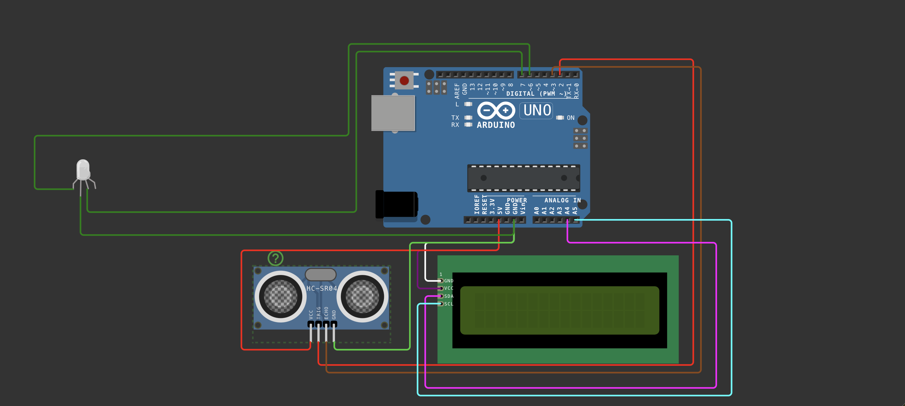

# Smart Parking Management System
### IoT Automated Slot Detection & Visual Semaphore Prototype

  

## Project Description
This project simulates a **Single Node Parking Lot Management System** designed for automated infrastructure. Unlike standard reverse sensors, this system is designed to be mounted on the parking slot infrastructure to monitor occupancy in real time.

It utilizes ultrasonic echolocation to detect vehicle presence and controls a **Visual Semaphore (RGB LED)** to guide drivers. The system features a custom signal processing algorithm to prevent false occupancy triggers caused by transient sensor noise.

## Key Features
* **Infrastructure Grade Detection**
    Monitors specific parking slots with high precision distance calculation (±3mm accuracy).

* **Noise Filtering Algorithm**
    Implements a 3 cycle signal debouncing logic (approx. 150ms validation window) to ignore sensor glitches and ensure occupancy status is only updated when a vehicle is confirmed.

* **Visual Traffic Guidance**
    Replaces noisy audio alerts with industry standard visual cues using an RGB LED semaphore system (Green for Free, Red for Occupied).

* **Real Time Telemetry**
    Displays live distance metrics and status updates on a 16x2 I2C LCD screen for maintenance and monitoring.

## Technical Specifications
* **Microcontroller:** Arduino Uno (ATmega328P)
* **Sensor:** HC-SR04 Ultrasonic Module
* **Visual Output:** Common Cathode RGB LED (Red/Green Logic)
* **Telemetry:** 16x2 LCD with I2C Interface
* **Language:** C++ (Wiring Framework)

## Operational Logic
1.  **Scanning:** The sensor triggers a 10µs pulse to measure distance.
2.  **Filtering:** If an object is detected within 30cm, the system increments a stability counter.
3.  **Confirmation:** Only after 3 consecutive positive detections does the system verify the slot as "OCCUPIED".
4.  **Signaling:**
    * **Status FREE:** RGB LED emits Green; LCD shows Status: FREE.
    * **Status OCCUPIED:** RGB LED switches to Red; LCD shows Status: OCCUPIED.

## Pin Configuration
* **Trigger Pin:** Digital 2
* **Echo Pin:** Digital 3
* **Red Signal:** Digital 6
* **Green Signal:** Digital 7
* **LCD SDA:** Analog 4
* **LCD SCL:** Analog 5

## Simulation & Deployment
1.  **Load Code:** Open the source code in Arduino IDE or Wokwi Simulator.
2.  **Install Libraries:** Install the `LiquidCrystal_I2C` library via the Library Manager.
3.  **Connect Sensor:** Wire the HC-SR04 Trig to Pin 2 and Echo to Pin 3.
4.  **Connect Display:** Wire the LCD SDA to A4 and SCL to A5.
5.  **Connect LED:** Wire the RGB LED Long Leg to GND (Common Cathode), Red Leg to Pin 6, and Green Leg to Pin 7.
6.  **Run:** Upload to the board to initialize the scanning sequence.

## Live Prototype Demo

